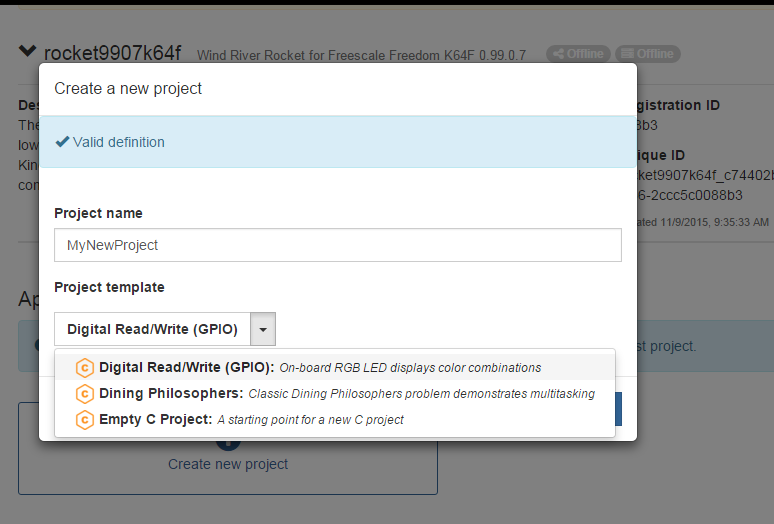

<style>
table, th, td {
    border: 1px solid black;
    border-collapse: collapse;
}
th, td {
    padding: 5px;
}
</style>

# Freescale Freedom-K64F GPIO Example

You can use general purpose I/O (GPIO) functionality on a Freescale Freedom-K64F board. This example uses the GPIO interface to read an on-board switch and set the on-board RGB LED color combinations.

## You Need

* A Freescale Freedom-K64F board connected to the Helix App Cloud.

## Create the Project

1. From the Helix App Cloud, select **Create new project**.
2. When the dialog box appears, enter a Project name.
3. Select the **Digital Read/Write(GPIO)** example from the Project template drop-down.



## Example Description

The Kinetis K64 MCU has five 32-bit I/O ports. The ports are labeled A, B, C, D, and E.  Most of the I/O pins in the K64 MCU have multiple functions and are referred to by their port and pin. For example, the first pin on Port C is PTC1. Before the pins can be used, you must route the proper signal to it. 

The following table shows the configuration needed for this example:

| I/O Port and Pin | Pin Function | Direction |
|:----------------:|:------------:|:---------:|
|      PTA4        |GPIO/SW3      |  Input    |
|      PTB21       |GPIO/LED BLUE |  Output   |
|      PTB22       |GPIO/LED RED  |  Output   |
|      PTE26       |GPIO/LED GREEN|  Output   |

The example program starts in `main()` (in **main.c**). It calls `setup()` in **setup.c** to configure the GPIO pins that are needed, according to the table above, and then executes a loop that reads the state of switch SW3 and sets the on-board RGB LEDs to one of the color combinations.

### Step 1: Configure the Required Pins

According to the table in the example description, four GPIO pins are needed: PTA4, PTB21, PTB22, and PTE26. The first block of code in **main.c** configures the pins by calling `setup()` (implemented in **setup.c**).

The `setup()` function sets up the necessary I/O pins' function as GPIO, sets the GPIO pins' direction and turns off all of the RGB LEDs.

The following code excerpts show how the GPIO pin for the red LED is set up:

``` cpp
    /* Configure the RGB LED GPIO pins */

    status = pinmux_pin_set(pinmux, K64_PIN_PTB22,
                            K64_PINMUX_FUNC_GPIO | K64_PINMUX_GPIO_DIR_OUTPUT);

    ...

    /* Set the GPIO output pins to turn off the RGB LED */

    status = gpio_pin_write(gpio_b, LED_R, LED_OFF);

```

### Step 2: Set the On-Board RGB LED Colors

The loop in `main()` reads the state of switch SW3 and cycles through the RGB LED color combinations if SW3 is not pressed, by setting the RGB GPIO pins' output and displaying the color information on the console. (The RGB LED and SW3 are located next to the micro SD slot on the board.)

``` cpp
    uint32_t sw_value;
    uint32_t led_value = 0;

    ...

    while (1)
        {
        /* set to next LED state if switch is not pressed */

        gpio_pin_read(gpio_a, SW3, &sw_value);

        if (sw_value == SW_OFF) {
            if (++led_value > 7)
                led_value = 0;
        }

        switch (led_value)
            {
            case 0: // OFF
                PRINT("LED is OFF\n");
                gpio_pin_write(gpio_b, LED_R, LED_OFF);
                gpio_pin_write(gpio_b, LED_B, LED_OFF);
                gpio_pin_write(gpio_e, LED_G, LED_OFF);
                break;
            case 1: // RED
                PRINT("LED is Red\n");
                gpio_pin_write(gpio_b, LED_R, LED_ON);
                break;
            case 2: // BLUE
                PRINT("LED is Blue\n");
                gpio_pin_write(gpio_b, LED_R, LED_OFF);
                gpio_pin_write(gpio_b, LED_B, LED_ON);
                break;
            case 3: // GREEN
                PRINT("LED is Green\n");
                gpio_pin_write(gpio_b, LED_B, LED_OFF);
                gpio_pin_write(gpio_e, LED_G, LED_ON);
                break;
            case 4: // RED+BLUE
                PRINT("LED is Red+Blue\n");
                gpio_pin_write(gpio_e, LED_G, LED_OFF);
                gpio_pin_write(gpio_b, LED_R, LED_ON);
                gpio_pin_write(gpio_b, LED_B, LED_ON);
                break;
            case 5: // RED+GREEN
                PRINT("LED is Red+Green\n");
                gpio_pin_write(gpio_b, LED_B, LED_OFF);
                gpio_pin_write(gpio_e, LED_G, LED_ON);
                break;
            case 6: // BLUE+GREEN
                PRINT("LED is Blue+Green\n");
                gpio_pin_write(gpio_b, LED_R, LED_OFF);
                gpio_pin_write(gpio_b, LED_B, LED_ON);
                break;
            case 7: // RED+BLUE+GREEN
                PRINT("LED is Red+Blue+Green\n");
                gpio_pin_write(gpio_b, LED_R, LED_ON);
                break;
            default:
                PRINT ("Error - Out of range value: %d\n", led_value);
                led_value=0;
                break;
            }

        /* wait a while, then loop again */
        task_sleep(SLEEPTICKS);
        }
```

